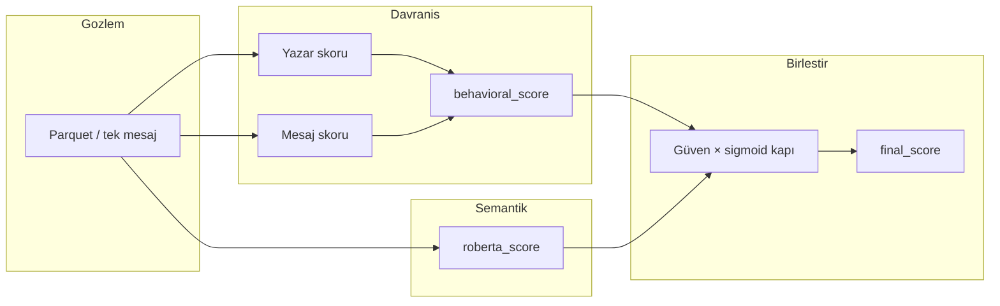

# Fusion

<p align="left">
  
  
  
  
  
</p>

<p align="center">
  
</p>

Sosyal medya içeriklerinde **manipülasyona yakın davranış örüntülerini** bulan açıklanabilir bir risk skorlama modeli.

Bu bir denetimli bot sınıflandırıcı değildir. Veride `bot`, `human`, `manipulative`, `organic` etiketleri yok. Fusion etiket ezberlemez; davranış ve semantik sinyallerden `0–1` arası bir risk skoru üretir.

*Inter-University Datathon — ulusal 3. sıra.*

---

## Ne üretir

```text
final_score:  0.0 = düşük risk    1.0 = yüksek risk
```

Skor bir kimlik veya niyet kanıtı değildir. Sıralanabilir bir manipülasyon-risk sinyalidir.

Fusion şunlara bakar:

- Mesaj organik mi, koordineli/tekrarlı mı?
- `author_hash` normal tempo mu, patlama/yüksek frekans mı?
- Aynı veya yakın metin kısa pencerede çoğalıyor mu?
- DistilRoBERTa metni bot/manipülasyon dağılımına yakın görüyor mu?
- Nihai skor hangi bileşenlerden geliyor?

---

## Mimari



```text
behavioral_score = author_weight * author_score
                 + message_weight * message_score

raw_b = behavioral_prior * confidence(behavioral_score)
raw_r = semantic_prior   * confidence(roberta_score)

roberta_effective   = σ(k * (raw_r - raw_b))
behavioral_effective = 1 - roberta_effective

final_score_before_rules =
    behavioral_effective * behavioral_score
  + roberta_effective    * roberta_score
```

Güven, 0.5'ten uzaklıkla parabolik artar (`min_weight=0.20`, `power=2`):

```text
confidence(s) = 0.20 + 3.20 * (s - 0.5)^2
```

Hard kural tetiklenirse `final_score = 1.0`.

Ayrıntı: [DESIGN.md](DESIGN.md).

---

## Katmanlar

**Davranış (öncelikli).** Yazar: paylaşım sıklığı, saatlik patlama, mesaj aralığı, aynı metin tekrarı, çok yazarlı tekrar, dil/tema/duygu çeşitliliği. Mesaj: tekrar sayısı, kısa pencerede yoğunluk, hashtag ve token spam, uzun metin, anahtar kelime.

**Semantik (destek).** Varsayılan checkpoint `junaid1993/distilroberta-bot-detection` (İngilizce). Desteklenmeyen dilde skor `0.50` (nötr). Bu katman tek başına karar vermez.

**Hard kural.** Aşırı saatlik patlama; aynı metnin çok tekrar + çok yazar + kısa pencerede kümelenmesi.

---

## Kurulum

Python 3.10+.

```bash
git clone https://github.com/yigitcancskun/fusion.git
cd fusion
python3 -m venv .venv
source .venv/bin/activate
pip install -r requirements.txt
```

```bash
make verify
```

---

## Kullanım

```bash
python main.py --mode write-config --output-config config.sample.json
python main.py --mode validate --config config.sample.json
python main.py --mode score-single --config config.sample.json --message "örnek mesaj"
python main.py --mode build --config config.sample.json
python main.py --mode rescore --config config.sample.json
```

| Kip | Ne yapar |
| :--- | :--- |
| `write-config` | Varsayılan JSON şablonunu yazar |
| `validate` | Mevcut SQLite / parquet / manifest şemasını doğrular |
| `score-single` | Tek mesajı mevcut store bağlamında skorlar |
| `build` | Parquet'ten SQLite store, yazar/mesaj skorları, manifest |
| `rescore` | Store'u yeniden kurmadan ağırlık/eşik değişimini uygular |

Notebook akışı: [`fusion.ipynb`](fusion.ipynb).

Girdi parquet varsayılanı `data/datathonFINAL.parquet` (repoda yok; yarışma verisi). Çıktılar `data/` altına yazılır ve git'e girmez.

---

## Dizin

```text
main.py                 CLI giriş noktası
fusion_pipeline/        config, temizleme, skor, store, inference
config.sample.json      örnek config
fusion.ipynb            keşif / QA
formula_scoring_pipeline.py   eski import uyumu
tests/                  pytest
DESIGN.md               formüller ve sınırlar
```

---

## Ekip

Yiğitcan Coşkun · Sena Yılmaz · Çağrı Okan · Süleyman Uzun

---

## Lisans

[MIT License](LICENSE) © 2026 Yiğitcan Coşkun, Sena Yılmaz, Çağrı Okan, Süleyman Uzun
